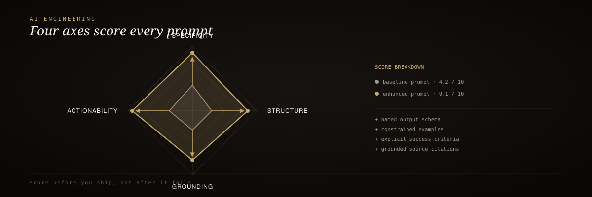

<div align="center">
<p align="center"></p>
  
</div>

<br/>

<div align="center">
  <h3>RIG AI Engineering</h3>
  <p><em>The prompt intelligence engine — score, enhance, and fix prompts before they ever ship.</em></p>
</div>

<div align="center">


[](https://github.com/mrodgersjs-web/rig-ai-engineering/actions/workflows/smoke.yml)


</div>

<br/>

> 🥇 The same scoring rubric that hardens prompts across the RIG fleet — Jake, Hermes, Codex, Claude Code — packaged as a public, installable Python library. No network, no LLM call, fully reproducible.

## 60-second install

```bash
pip install git+https://github.com/mrodgersjs-web/rig-ai-engineering.git
```

```bash
rig-ai score -p "Write a Python function that returns the sum of two integers."
```

```text
RIG Prompt Score: 18/40 (C)

  Specificity     5/10 — Moderate specificity (numbers, output_format). Add file paths, line numbers, or exact output format.
  Doctrine        3/10 — Add RIG doctrine: success criteria, scope boundaries, verification steps, or a lattice coordinate (e.g., D1, L7).
  Context         3/10 — Missing context. Reference files (#file:), skills, prior work, or project state so the agent can ground its answer.
  Actionability   7/10 — Some actionability (action_verbs). Add explicit first step or success condition.
```

## How it works

<div align="center">
  
</div>

<sub align="center">raw prompt → 4-axis regex scorer → grade (A+ to F) → enhance / fix → operator-grade prompt</sub>

## The 4-axis scoring rubric

Every prompt is scored 0–10 on four axes, for a total out of 40.

| Axis | What it measures | High-signal markers |
| :-- | :-- | :-- |
| **Specificity** | Concreteness and precision | Numbers, file paths, output format, constraints, examples, verification |
| **Doctrine** | RIG / agentic structure | Lattice coordinates (`D1`, `L7`), acceptance criteria, scope, verification, success criteria |
| **Context** | Grounding in real project state | File references, skill loads, prior work, project/repo terms |
| **Actionability** | Clarity of next action | Action verbs, sequenced steps, conditions, directives, negatives |

## Results: grade bands

| Total | Grade | Meaning |
| :-: | :-: | :-- |
| 36–40 | **A+** | Operator Grade |
| 32–35 | A | — |
| 28–31 | B | — |
| 22–27 | C | — |
| 16–21 | D | — |
| 0–15 | F | Rewrite Required |

## Why it exists

- **Local-first** — regex heuristics, string length, word counts only; no model, API, or external service
- **Fully reproducible** — scores are deterministic for the same input, every time
- **One CLI, five verbs** — `score`, `enhance`, `fix`, `doctor`, `suggest`
- **20-template library** — from `code-review` to `schema-design`, ready to insert into a weak prompt

<details>
<summary><strong>Full CLI reference</strong></summary>

<br/>

```bash
# machine-readable score
rig-ai score -p "Refactor auth.py to use bcrypt" --json

# restructure a weak prompt with a lattice coordinate, acceptance criteria, verification
rig-ai enhance -p "fix the bug"

# strip filler and conversational openers, then enhance
rig-ai fix -p "hi, can you just simply fix it?"

# health check for the engine, templates, core functions
rig-ai doctor

# top 5 matching templates from the built-in library
rig-ai suggest "write unit tests"
```

**Programmatic usage:**

```python
from rig_ai import score, enhance, fix_prompt

result = score("Refactor src/auth.py to use bcrypt.")
print(result["total"])  # 18
print(result["grade"])  # C

better = enhance("fix the bug")
fixed = fix_prompt("hi, can you just simply fix it?")
```

**Template library** (`rig_ai/templates.py`, 20 entries):

`code-review` · `unit-test` · `refactor` · `debug` · `feature-design` · `api-design` · `doc-update` · `performance-audit` · `security-review` · `dependency-upgrade` · `data-pipeline` · `prompt-optimize` · `onboarding` · `incident-response` · `release-notes` · `competitor-analysis` · `user-story` · `migration-plan` · `cli-tool` · `schema-design`

</details>

## Documentation

| Resource | Description |
| :-- | :-- |
| `rig_ai/templates.py` | 20-template library |
| `pytest` | Run the test suite (`pip install -e ".[dev]"`) |
| [LICENSE](LICENSE) | MIT |

---

<div align="center"><sub>Built by Mike Rodgers · Forward Deployed Engineer · <a href="https://rodgersintelligence.com">rodgersintelligence.com</a></sub></div>
